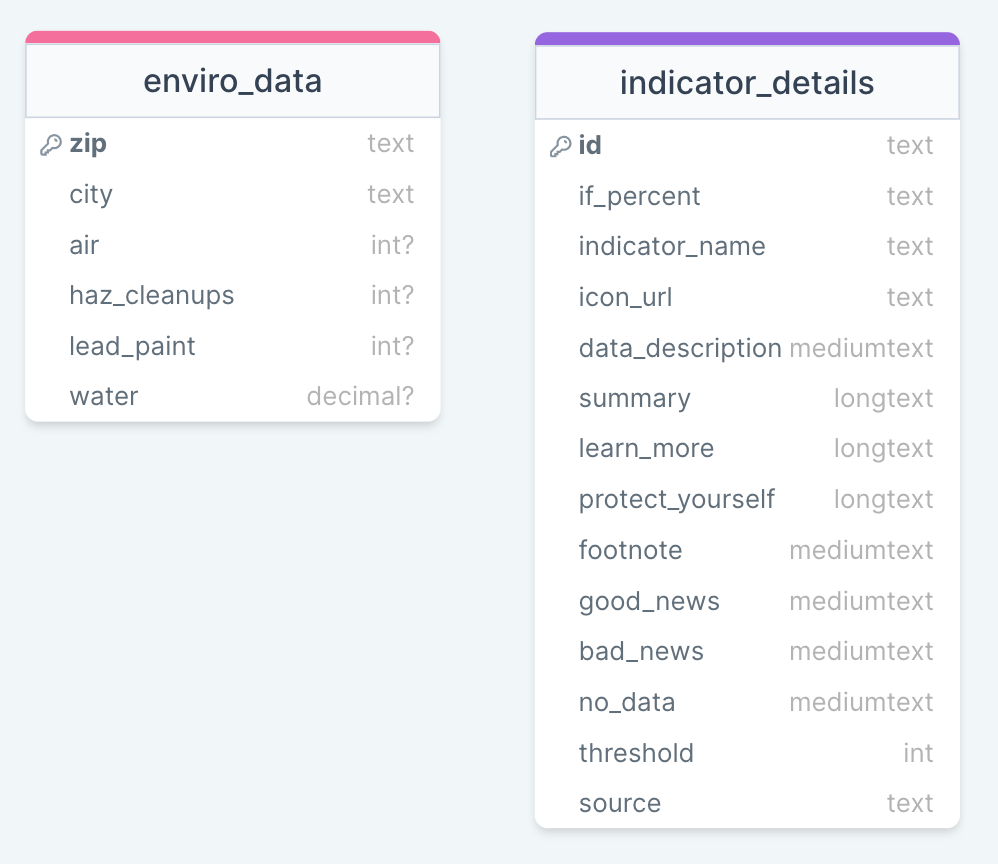

# MyEnviro

## Summary
MyEnviro allows individuals in California to look up local environmental metrics, and get recommendations on how to protect against environmental hazards.

## Set-up
### Dependencies
- In your terminal, navigate to the project directory and run `npm install`. This will install Express and other server-related dependencies.

- `cd client` and run `npm install`. This will install React client dependencies.


### Database
- If you do not have MySQL, [install it](https://dev.mysql.com/doc/mysql-installation-excerpt/5.7/en/) before proceeding.

- Open MySQL in your terminal by running `mysql -u root -p`

- Create a new database called "my_enviro": `CREATE DATABASE my_enviro`

- Create an `.env` file in the project folder, and write your MySQL authentication information in it. For example:
```bash
DB_HOST=localhost
DB_USER=root
DB_NAME=my_enviro
DB_PASS=(your password)
```

- Return to your MySQL terminal window. Run `SHOW GLOBAL variables LIKE 'local_infile'`. This will check if your MySQL allows data imports from a local file - we'll need to do this for our database.
    - If the value for `'local_infile'` is `ON`, open another terminal window, navigate to the project folder and run `npm run migrate`. Your database should be ready!
    - If the value for “local_infile” is `OFF`, proceed to next step. :)
- Still in the MySQL terminal, run `SET GLOBAL local_infile=true`. Then run the following commands to quit and restart MySQL with local_infile enabled:
    - `quit`
    - `mysql --local_infile=1 -u root -p`
- Open another terminal window, navigate to the project folder and run `npm run migrate`. Your database should be ready!

- (After this, if you need to reload the database you can simply run `npm run migrate` - you only need to set global permissions once.)

- In your MySQL terminal window, run `USE my_enviro;` then `SHOW TABLES;`. Your database should contain 2 tables: `enviro_data` and `indicator_details`



- You can run `DESCRIBE enviro_data;` and `DESCRIBE indicator_details;` to check that your tables have been set up correctly.

### Development
- Run `npm start` in project directory to start the Express server on port 5000

- In another terminal window, `cd client` and `run npm start` to start the client in development mode with hot reloading in port 3000.


## Learn More
Full [project description here](https://docs.google.com/document/d/1EyuTybF4YVzwdO1ak_yoinMkoNYwa-Yj6S7IBZ90VEE/edit#).


_This is a student project that was created by Zoe Laventhol at [CodeOp](http://codeop.tech), a full stack development bootcamp in Barcelona._